> [!CAUTION]
> These design documents are generated by AI and may not be fully accurate or complete. They are intended to provide a starting point for understanding the system architecture and design patterns used in the template-fastapi application.

# Internal Design Specification

## Architecture Overview

The template-fastapi application follows a layered architecture pattern with clear separation of concerns, enabling maintainability, testability, and scalability.

## System Architecture

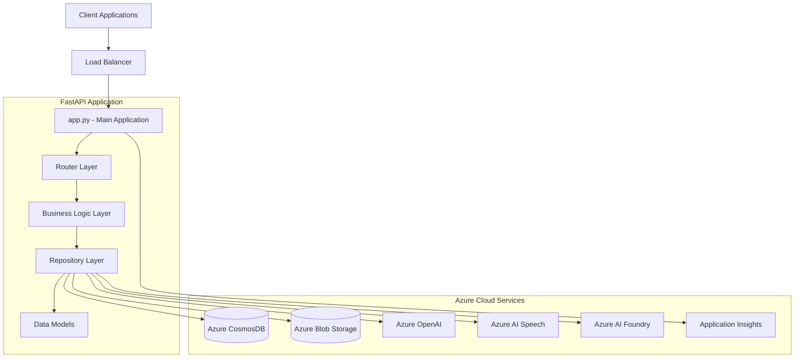

## Package Structure and Responsibilities

### Core Application (`template_fastapi/`)

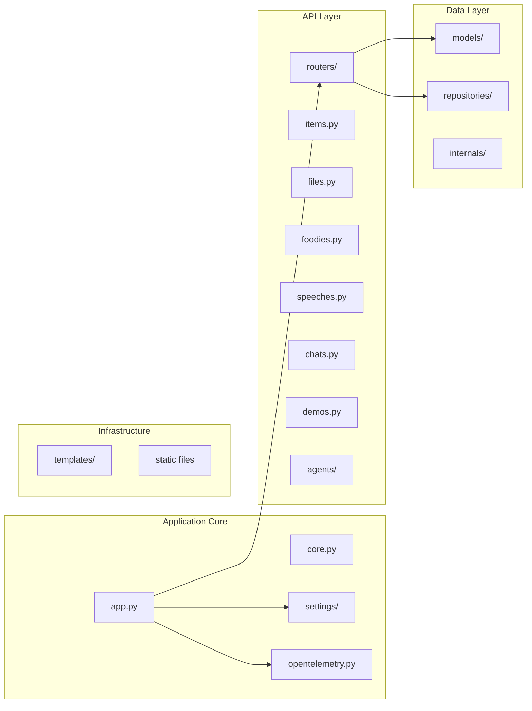

### Package Responsibilities

#### `app.py` - Application Bootstrap

- FastAPI application initialization
- Router registration and configuration
- Middleware setup (CORS, logging, monitoring)
- Azure Application Insights integration
- Telemetry and observability configuration

#### `routers/` - API Endpoint Handlers

- **Purpose**: HTTP request routing and response handling
- **Responsibilities**:
  - Request validation using Pydantic models
  - HTTP status code management
  - Error handling and exception transformation
  - Business logic delegation to repositories
  - Response formatting

#### `repositories/` - Data Access Layer

- **Purpose**: External service integration and data persistence
- **Responsibilities**:
  - Azure service client management
  - Data transformation between external APIs and internal models
  - Connection pooling and retry logic
  - Service-specific error handling

#### `models/` - Data Models

- **Purpose**: Data structure definitions and validation
- **Responsibilities**:
  - Pydantic model definitions for request/response
  - Data validation rules and constraints
  - Serialization/deserialization logic
  - Type safety enforcement

#### `settings/` - Configuration Management

- **Purpose**: Environment-based configuration
- **Responsibilities**:
  - Environment variable loading
  - Service connection configuration
  - Feature flag management
  - Logging configuration

## Service Communication Flow

### Request Processing Flow

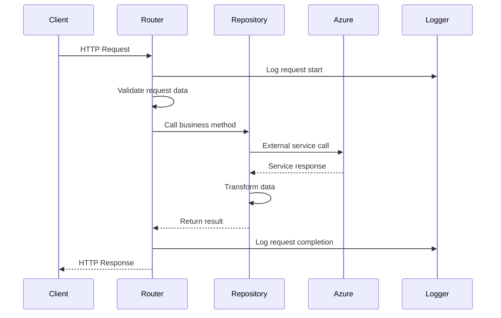

### Error Handling Flow

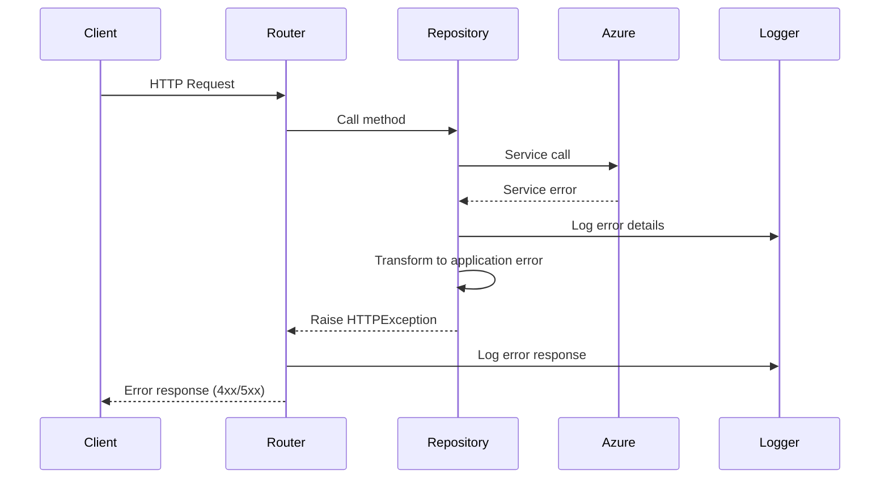

## Agent System Architecture

### LangGraph Agent Flow

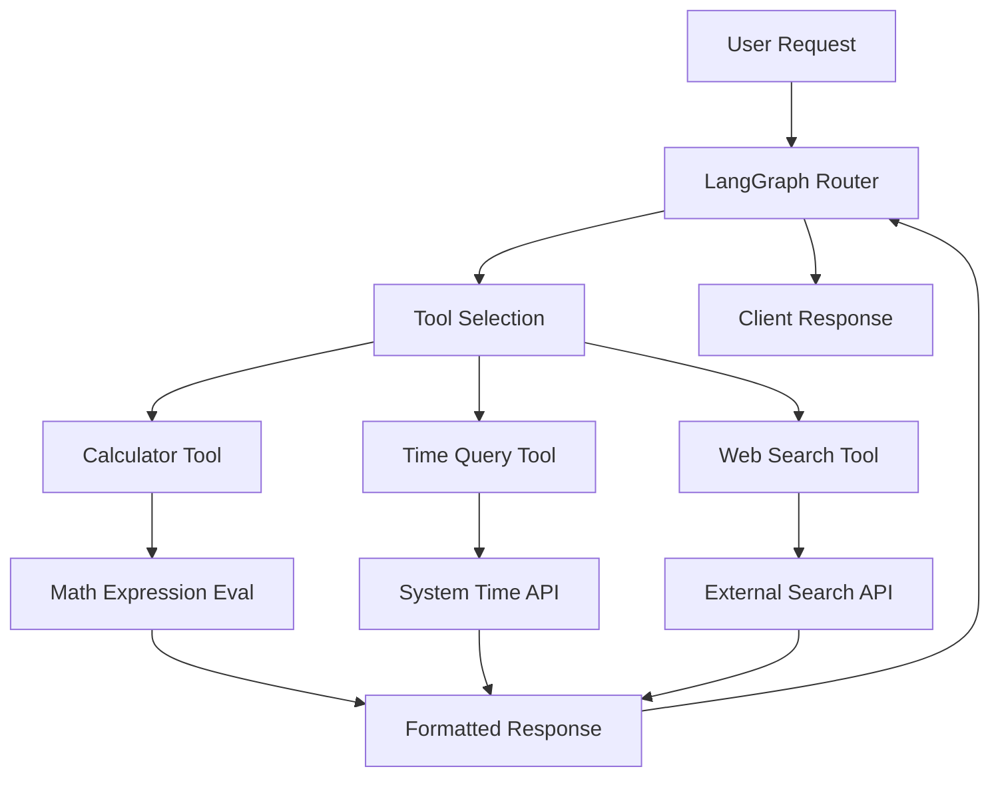

### Azure AI Foundry Agent Flow

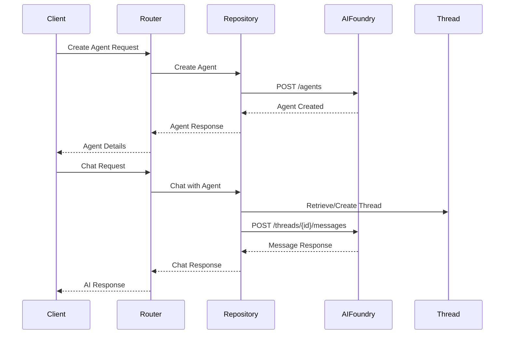

## Data Models and Relationships

### Core Entity Relationships

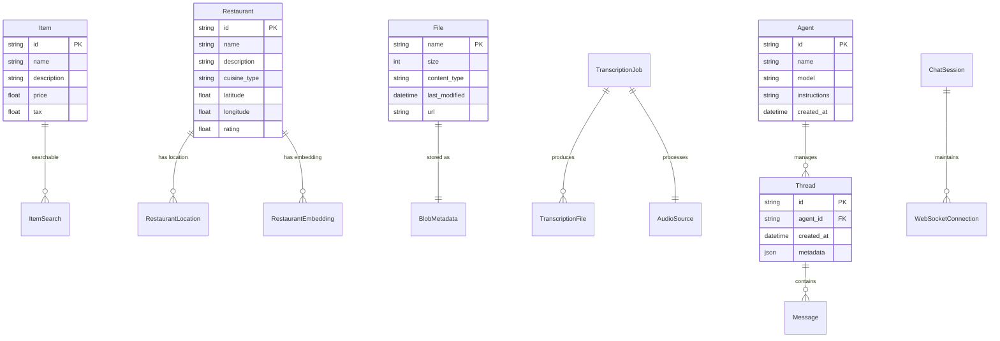

## Service Integration Patterns

### Repository Pattern Implementation

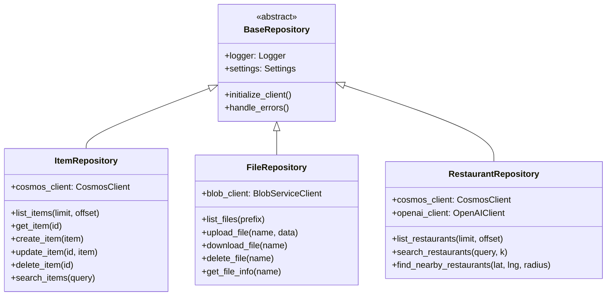

### Configuration Management Pattern

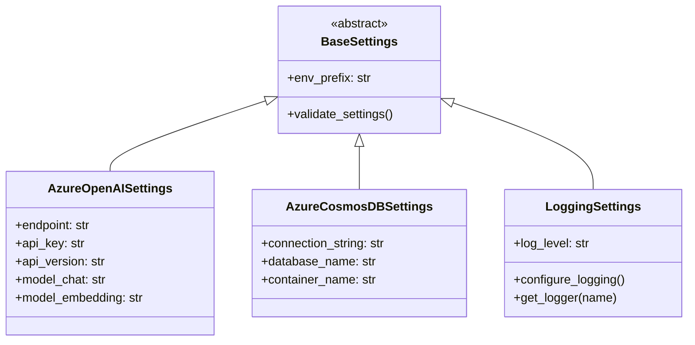

## Security and Monitoring Integration

### Logging and Telemetry Flow

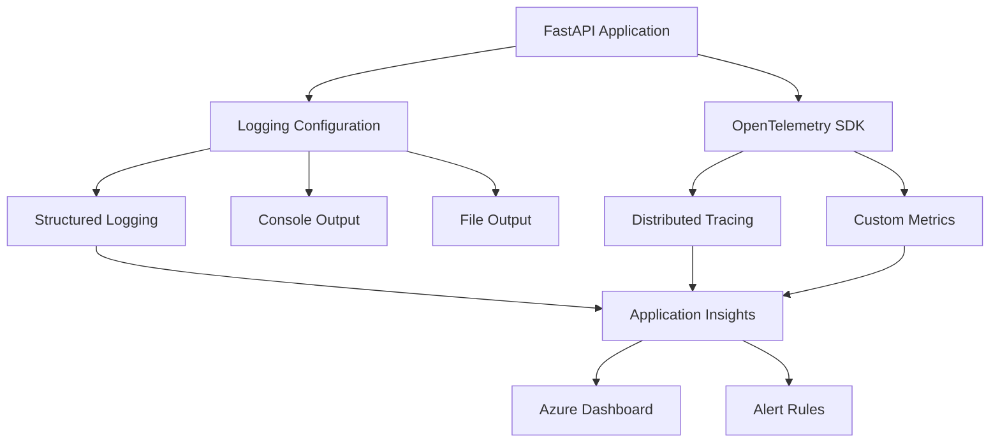

### Environment-based Configuration

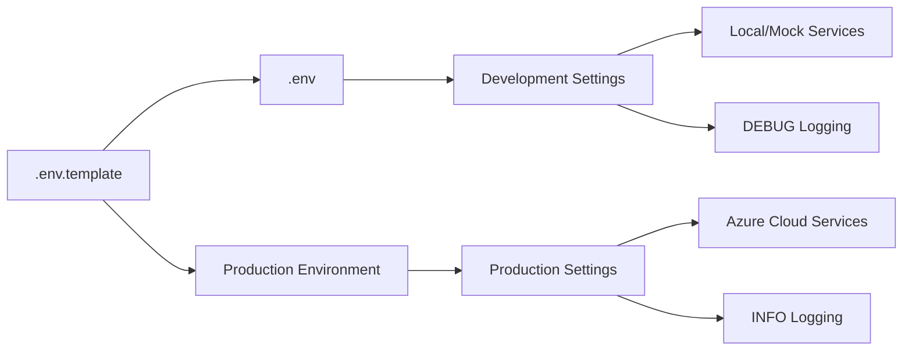

## Performance and Scalability Considerations

### Caching Strategy

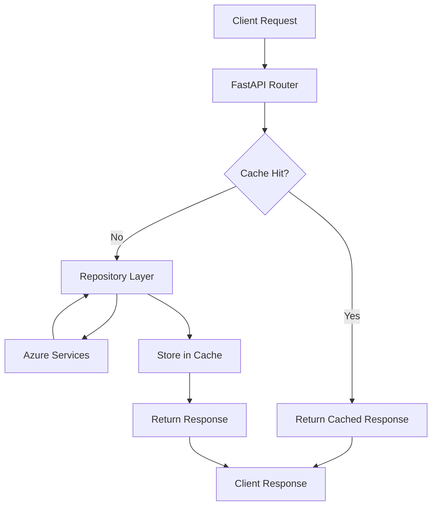

### Connection Pooling

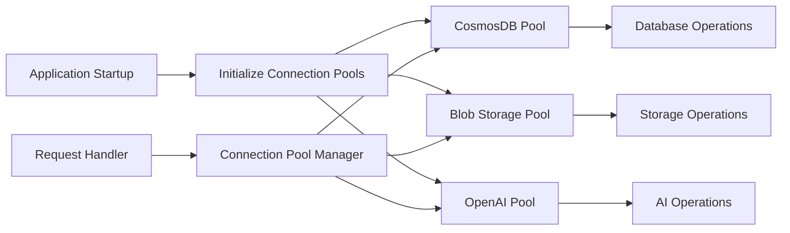

## Testing Strategy

### Test Architecture

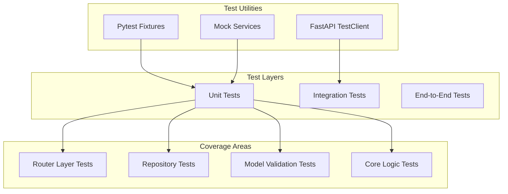

This internal design specification provides a comprehensive view of the application's architecture, data flow, and component interactions, enabling developers to understand and extend the system effectively.
